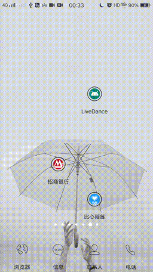
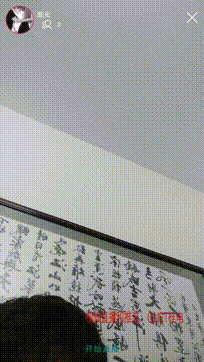

# liveDance
liveDance VR直播APP

该项目基于FFmpeg+OpenGL ES+OpenSL ES+retrofit+material等开发完成,这是一款支持传统直播和VR直播的安卓App,借鉴了抖音和B站的功能，再加上增加的特色就是VR360度全景视频的播放和直播，在这样一个5G即将到来的时代，VR在直播领域的应用大大提升了用户的参与感，对于众多行业都具有颠覆意义。

### 1.简介

#### 涉及的技术和知识点
   主要开发语言C/C++,JAVA。解码使用的FFmpeg,涉及多线程，以及生产者和消费者(一边解码成PCM数据一边使用),推流用的RTMP的C语言库，画面渲染openGL 自定义surface和纹理绑定，使用了VBO 顶点缓存和FBO帧缓存来做离屏渲染等。业务层全部使用java开发，通过JNI调用底层的方法，大概是这么多吧，写完了不记得了，哈哈哈。

 接下来主要介绍以下app的主要功能和demo演示
 + 首页模块
   - 海报视频、Banner 海报、热门视频、热门主播。
 + 直播间(VR/2D)
   - 观看直播、观看视频，送礼物、打赏
 + 主播信息
   - 主播头像、昵称、直播间标题、所属分类。
 + 直播间信息
   - 直播间公告、预告、贡献榜、贵宾、粉丝团。
 + 弹屏设置
   - 开启、关闭。关注、取消关注。
 + 举报
   - 举报对象、举报原因。
 + 我的关注
  - 关注列表：直播间标题、主播昵称、所属分类、开播状态、封面图。
查看主播主页
+ 视频列表  
  - 视频标题、时间、封面图、点赞人数。 
+ 图片和视频上传
  - 本地相册上传，拍照上传等

#### 特色功能
 1、支持当前播放页直接切换播放源</br>
 2、VR全景视频</br>
 3、支持软解码和硬解码，优先选用GPU解码，解码速度更快</br>
 4、选择背景音乐录制视频</br>
 5、选择图片和mp3生成视频</br>
 6、VR视频可开启传感器和双眼模式</br>
 7、添加水印</br>
 8、支持rtmp,http,hls等多种流媒体协议</br>
 9、滤镜 [未完成]  </br>
 10、美颜 [未完成]</br>
11、 其它功能请下载apk安装包体验


#### demo演示





### 2.环境配置

```
        ndk{
            abiFilters "armeabi", "x86"
        }

        allprojects {
        repositories {
        maven { url 'https://jitpack.io' }
        }
    }

    externalNativeBuild {
            cmake {
                cppFlags "-frtti -fexceptions"
                abiFilters "armeabi", "x86"
            }
        }
        sourceSets {
            main {
                jniLibs.srcDirs = ['src/main/jniLibs']
            }
        }

         externalNativeBuild {
        cmake {
            path "CMakeLists.txt"

        }
    }

```

#### cmakelist文件配置
```
cmake_minimum_required(VERSION 3.4.1)

include_directories(src/main/cpp/include)
set(CMAKE_C_FLAGS "${CMAKE_C_FLAGS} -DNO_CRYPTO")
add_library( # Sets the name of the library.
        native-lib

        SHARED
        src/main/cpp/PushCallJava.cpp
        src/main/cpp/PushQueue.cpp
        src/main/cpp/RtmpPush.cpp
        src/main/cpp/native-lib.cpp
        src/main/cpp/WlCallJava.cpp
        src/main/cpp/WlFFmpeg.cpp
        src/main/cpp/WlAudio.cpp
        src/main/cpp/WlQueue.cpp
        src/main/cpp/WlPlaystatus.cpp
        src/main/cpp/Video.cpp

        src/main/cpp/librtmp/amf.c
        src/main/cpp/librtmp/hashswf.c
        src/main/cpp/librtmp/log.c
        src/main/cpp/librtmp/parseurl.c
        src/main/cpp/librtmp/rtmp.c
        )

find_library( # Sets the name of the path variable.
        log-lib

        # Specifies the name of the NDK library that
        # you want CMake to locate.
        log)

add_library(avcodec-57 SHARED IMPORTED)
set_target_properties(avcodec-57
        PROPERTIES IMPORTED_LOCATION
        ${CMAKE_SOURCE_DIR}/src/main/jniLibs/${ANDROID_ABI}/libavcodec-57.so)


add_library(avdevice-57 SHARED IMPORTED)
set_target_properties(avdevice-57
        PROPERTIES IMPORTED_LOCATION
        ${CMAKE_SOURCE_DIR}/src/main/jniLibs/${ANDROID_ABI}/libavdevice-57.so)


add_library(avfilter-6 SHARED IMPORTED)
set_target_properties(avfilter-6
        PROPERTIES IMPORTED_LOCATION
        ${CMAKE_SOURCE_DIR}/src/main/jniLibs/${ANDROID_ABI}/libavfilter-6.so)


add_library(avformat-57 SHARED IMPORTED)
set_target_properties(avformat-57
        PROPERTIES IMPORTED_LOCATION
        ${CMAKE_SOURCE_DIR}/src/main/jniLibs/${ANDROID_ABI}/libavformat-57.so)


add_library(avutil-55 SHARED IMPORTED)
set_target_properties(avutil-55
        PROPERTIES IMPORTED_LOCATION
        ${CMAKE_SOURCE_DIR}/src/main/jniLibs/${ANDROID_ABI}/libavutil-55.so)

add_library(postproc-54 SHARED IMPORTED)
set_target_properties(postproc-54
        PROPERTIES IMPORTED_LOCATION
        ${CMAKE_SOURCE_DIR}/src/main/jniLibs/${ANDROID_ABI}/libpostproc-54.so)

add_library(swresample-2 SHARED IMPORTED)
set_target_properties(swresample-2
        PROPERTIES IMPORTED_LOCATION
        ${CMAKE_SOURCE_DIR}/src/main/jniLibs/${ANDROID_ABI}/libswresample-2.so)


add_library(swscale-4 SHARED IMPORTED)
set_target_properties(swscale-4
        PROPERTIES IMPORTED_LOCATION
        ${CMAKE_SOURCE_DIR}/src/main/jniLibs/${ANDROID_ABI}/libswscale-4.so)


target_link_libraries( # Specifies the target library.
        native-lib
        avcodec-57
        avdevice-57
        avfilter-6
        avformat-57
        avutil-55
        postproc-54
        swresample-2
        swscale-4
        OpenSLES
        # Links the target library to the log library
        # included in the NDK.
        ${log-lib})

```

#### 使用的主要框架
```
    implementation 'com.google.android.material:material:1.2.0-alpha04'
    implementation 'com.github.bumptech.glide:glide:4.11.0'
    annotationProcessor 'com.github.bumptech.glide:compiler:4.11.0'
    implementation 'com.github.CymChad:BaseRecyclerViewAdapterHelper:3.0.0-beta11'
    implementation 'com.squareup.retrofit2:retrofit:2.7.1'
    implementation 'com.squareup.retrofit2:converter-gson:2.7.1'
    implementation 'com.squareup.retrofit2:adapter-rxjava:2.7.1'
    implementation project(path: ':myplayer')
    implementation 'com.squareup.retrofit2:converter-scalars:2.3.0'
    implementation  'com.neovisionaries:nv-websocket-client:2.2'

```

### 3.主要API接口介绍

```
## 播放器APi (WLplayer)
 public void parpared() //异步开始准备播放，成功后会回调WlOnPreparedListener接口
 public void start()  //开始播放
 public void pause()  //暂停
 public void resume();//暂停后恢复播放
 public  void stop() //停止播放释放资源
 public void seek(int sedc) //进度条拖动
 public void setGlSurfaceView(GlSurfaceView glSurfaceView) //设置平面显示的surface
 public void setVrSurfaceView(VrSurfaceView vrSurfaceView) //设置VR显示的surface
 public void setOpenVr(boolean openVr) //设置是否打开VR模式
 public void setSource(String source) //设置播放源
 public void playNext(String url)  //设置下一个播放源
 public void onCallNext()  //切换播放设置好的下一个播放源
 public double getDuration();//获取时长（如果有在异步准备好后可获取）
 ....

## 相机APi(CameraView)

public void setWaterMark(String text) //设置水印
public void setCameraId(int cameraId) //切换前后置摄像头
public void stopPreView() //停止预览
public void startPreView() //开始预览
....


## 推流（PushVideo）

 public void initLivePush(String url)//初始化推流地址
 public void pushSPSPPS(byte[] sps,byte[] pps) //推出pps,sps数据
 public void pushVideoData(byte[] data,boolean keyframe)//推画面数据
 public void pushAudioData(byte[] data);//推声音数据
 public void stopPush()//停止推流

 回调
 public interface ConnectListenr {

    void onConnecting();  //连接中

    void onConnectSuccess(); //连接服务器成功

    void onConnectFail(String msg); //连接失败

    .....

}

....

## 网络（WsManager）

public static  void setReConnect(boolean Connect)//设置是否网络断开重连
public static WsManager getInstance()//获取单例的websocket
public void init(String url,Context context)//初始化连接的地址
private void setStatus(WsStatus status)//设置连接状态
public void disconnect()//关闭连接
public void reconnect()//断开重连
private void cancelReconnect()//关闭重连
private boolean isNetConnect()//网络是否可重连
.....
void getMessage(JSONObject data) throws JSONException;//消息回调等等..

```


<font color="red">这个项目包括后端，流媒体端以及客户端都是我一个人开发，比较完整，如果对次有兴趣，或者想知道一些原理的，可以关注一下我博客</font>
ps：如果对你有帮助，点下 star 就是对我最大的认可。
[博客](https://blog.csdn.net/qq_37704417)
